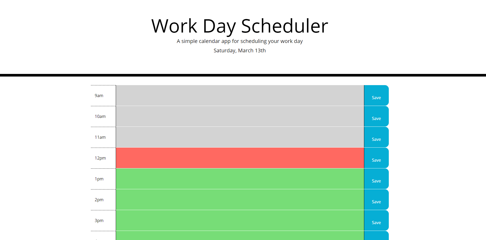
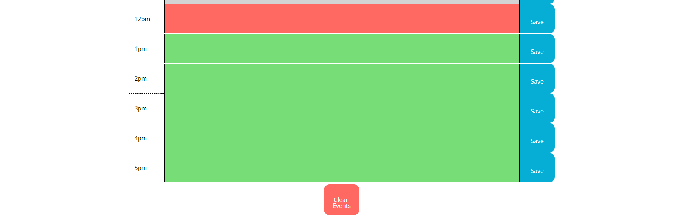
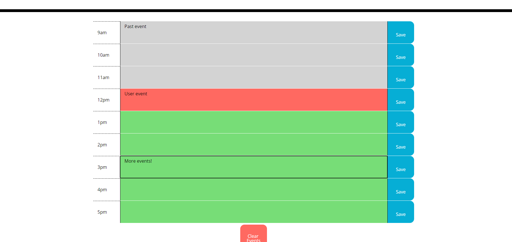

# WorkDayScheduler

## Description

In this assignment, we were given some HTML code already in place and told to make a event planner with it as the base. Specifically, we are using moment.js to work with current time and make the event planner update itself to reflect the current time. This was good practice for using moment.js and seeing its limitations and capabilities. It also was an interesting exercise in working with localStorage to make it populate information on the screen and have it persist across page reload. I took a little liberty and added a button to clear all the events in local storage and on the page for easier user interaction.

I had some trouble with making the boxes change color to match the current time at first, but once I realized I could use number comparing operators after I converted the times to the 24 hour standard, it was easier to work with.

My biggest struggle was making the local storage work for me with the multiple options and needing to be able to re-access them and display them in only certain text boxes. I feel like there is probably a way to make it more streamlined for pulling the information from local storage to display on the page, but I couldn't think of a good answer.

[Deployed Website](https://ashleyaggie.github.io/WorkDayScheduler)

## Changes Made

GIVEN I am using a daily planner to create a schedule

WHEN I open the planner

THEN the current day is displayed at the top of the calendar

    * Completed using moment.js and updating the paragraph tag in the markup with that information.

WHEN I scroll down

THEN I am presented with timeblocks for standard business hours

    * Timeblocks were hard-coded into the markup using bootstrap grid.

WHEN I view the timeblocks for that day

THEN each timeblock is color coded to indicate whether it is in the past, present, or future

    * Completed using moment.js and setting each time to a 24 hour value

    * The script gives each block a class that corresponds to whether it is before or after current time.

WHEN I click into a timeblock

THEN I can enter an event

    * All current and future events can be edited since they are textarea tags.

    * Past events cannot be edited as the properties were disabled, similar to the gif example.

WHEN I click the save button for that timeblock

THEN the text for that event is saved in local storage

    * Completed using localStorage.setItem and DOM manipulation to get the time value.

WHEN I refresh the page

THEN the saved events persist

    * Used localStorage.getItem and DOM manipulation to set the values equal to the stored information.

## Credits

Assignment is part of the SMU Coding Boot Camp

## License

Copyright (c) 2021 Ashley Wright

Permission is hereby granted, free of charge, to any person obtaining a copy
of this software and associated documentation files (the "Software"), to deal
in the Software without restriction, including without limitation the rights
to use, copy, modify, merge, publish, distribute, sublicense, and/or sell
copies of the Software, and to permit persons to whom the Software is
furnished to do so, subject to the following conditions:

The above copyright notice and this permission notice shall be included in all
copies or substantial portions of the Software.

THE SOFTWARE IS PROVIDED "AS IS", WITHOUT WARRANTY OF ANY KIND, EXPRESS OR
IMPLIED, INCLUDING BUT NOT LIMITED TO THE WARRANTIES OF MERCHANTABILITY,
FITNESS FOR A PARTICULAR PURPOSE AND NONINFRINGEMENT. IN NO EVENT SHALL THE
AUTHORS OR COPYRIGHT HOLDERS BE LIABLE FOR ANY CLAIM, DAMAGES OR OTHER
LIABILITY, WHETHER IN AN ACTION OF CONTRACT, TORT OR OTHERWISE, ARISING FROM,
OUT OF OR IN CONNECTION WITH THE SOFTWARE OR THE USE OR OTHER DEALINGS IN THE
SOFTWARE.